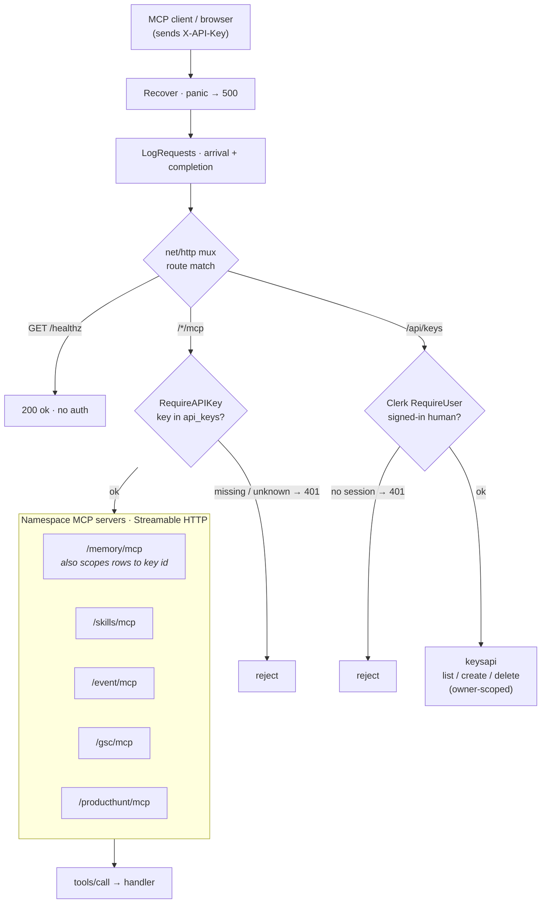
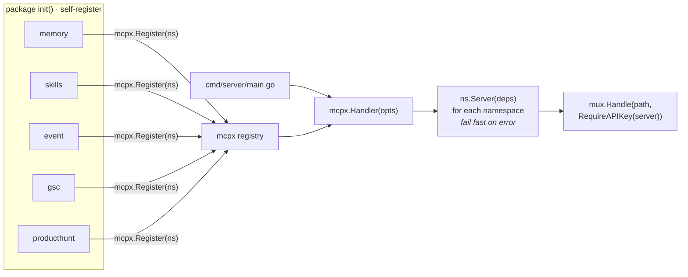

# go-mcp-server

Multi-namespace [Model Context Protocol](https://modelcontextprotocol.io) server in Go. Each namespace is an independent MCP server mounted on one HTTP mux over the **Streamable HTTP** transport:

| Route          | Namespace | Purpose                          |
| -------------- | --------- | -------------------------------- |
| `/memory/mcp`  | memory    | Memory storage & recall tools    |
| `/skills/mcp`  | skills    | Web search & scrape (Firecrawl)  |
| `/event/mcp`   | event     | Kafka produce/consume (Confluent)|
| `/gsc/mcp`     | gsc       | Google Search Console tools      |
| `/producthunt/mcp` | producthunt | Product Hunt API v2 (read) tools |

Namespaces self-register at startup, so adding a new one is a single package with an `init()` — `main.go` never changes. Router is stdlib `net/http`; a domain never reaches across another domain except through `internal/mcpx`.

## Architecture

Two things are worth seeing before the section-by-section detail: **how a request flows** at runtime, and **how the namespaces get mounted** at startup.

### Request lifecycle

Every request passes global middleware (panic recovery, then logging), hits the stdlib mux, and is admitted by the auth that belongs to *that route* — `X-API-Key` for the MCP namespaces, Clerk for the dashboard's key API, nothing for the liveness probe. Auth is per-route, not global, so a namespace can't forget it and `/healthz` never needs a credential.



`RequireAPIKey` only *admits* the caller. The **memory** namespace additionally resolves the same key to an `api_key_id` to scope every row — identity, not admission — reusing the resolver's warm cache so the second lookup is a map hit. See [§ Auth](#auth).

### Startup & self-registration

Each domain package calls `mcpx.Register` from its `init()`, so importing the package is enough to enroll its namespace. `mcpx.Handler` then builds every registered server, **failing fast** if any can't (missing dependency, bad config) rather than mounting a half-working server that only breaks on the first tool call. `cmd/server/main.go` never enumerates namespaces — adding one is a new package plus a blank import.



## Stack

- **Go 1.26+**
- **[github.com/modelcontextprotocol/go-sdk](https://github.com/modelcontextprotocol/go-sdk)** — official MCP SDK (Streamable HTTP handler, tool registration)
- **stdlib `net/http`** — mux + middleware
- **`log/slog`** — structured logging

## Layout

```
cmd/server/main.go     # config, graceful shutdown
internal/
  auth/                # X-API-Key format + resolver (api_keys table)
  mcpx/                # registry, Handler(), Chain(); integration test
  memory/              # per-user memories, hybrid RAG (Postgres + pgvector)
  skills/              # skills_find agent + skills_download + web primitives
  event/               # Kafka produce/consume over Confluent Cloud
  gsc/                 # Google Search Console (searchconsole/v1)
  producthunt/         # Product Hunt API v2 (GraphQL), read-only
frontend/              # Next.js docs + landing site (see § Frontend)
```

`internal/mcpx/integration_test.go` drives a real MCP client through
`initialize` + `tools/call` against the namespaces over an in-process
Streamable HTTP server.

## Auth

Every namespace requires an `X-API-Key` header carrying a key from the
`api_keys` table. `mcpx.RequireAPIKey` enforces this in the middleware chain, so
admission is checked once at the transport rather than per-tool — a namespace
cannot forget it. Unknown or malformed keys get a `401` before dispatch.

`GET /healthz` is the one exempt route: an uptime probe needs no credential, and
it reveals only liveness.

The **memory** namespace additionally resolves the same key to an `api_key_id`
and scopes every row to it. That is *identity*, not admission — which is why the
check exists in both places.

Keys are minted, never auto-provisioned (`auth.GenerateKey` /
`Resolver.Create`). Clients set the header in their MCP config; see
[.mcp.json](.mcp.json).

### skills namespace

An on-demand skill agent, a complete-skill downloader, and the raw web
primitives they are built on. **Nothing is stored** — every call reflects live
GitHub, so the catalogue is always current and the server holds no skill data.

- **`skills_find`** — the headline tool, and the go-to for obtaining *any* skill.
  Give it a natural-language requirement ("edit a PDF form", "build an MCP
  server") and it runs a live OpenAI tool-calling loop over the Firecrawl tools:
  search GitHub → pick the best Agent Skill → fetch its full `SKILL.md` → return
  the complete, ready-to-use skill with source links. Pass **multiple**
  requirements via `requirements: [...]` and they are resolved **in parallel**
  (one agent each, bounded fan-out), so batching is much faster than one call
  per need.
- **`skills_download`** — once you've located a skill, this downloads the
  **whole package**: every file in the skill folder (`SKILL.md` + scripts +
  reference files, recursively) via the GitHub contents API, fetched
  concurrently. Takes a GitHub URL (repo/tree/blob/raw) or `owner/repo/path`.
- **`firecrawl_search`** — web search returning ranked results (url, title,
  description); set `scrape=true` to also inline each page as markdown.
- **`firecrawl_scrape`** — fetch one URL as clean markdown (optionally raw HTML).

```
skills_find(requirements[])          skills_download(source)
   │  one OpenAI agent per need          │  GitHub contents API
   │  (parallel, bounded)                ├─ list skill dir (recursive)
   ├─▶ search_github ─┐                  └─ fetch every raw file (concurrent)
   └─▶ fetch_url ─────┴ Firecrawl        ▼
   ▼                                  complete skill: all files, in full
complete SKILL.md + sources
```

Config: `FIRECRAWL_API_KEY` powers the web tools (optional — without it Firecrawl
uses a lower unauthenticated rate limit, so those tools mount either way).
`skills_find` additionally needs `OPENAI_API_KEY` (and honours
`SKILLS_AGENT_MODEL`, default `gpt-4o-mini`); it is skipped when that key is
absent. `skills_download` needs no key — it reads public repos through GitHub's
public API unauthenticated. None are hard startup dependencies (unlike memory,
which requires Postgres).

### gsc namespace — Google Search Console

Tools over the official [Search Console API](https://developers.google.com/webmaster-tools)
(`google.golang.org/api/searchconsole/v1`, which subsumes the legacy Webmaster
Tools `webmasters/v3` surface): search-analytics reporting, URL inspection, and
sitemap/property management.

This is a Go port of the Python [**AminForou/mcp-gsc**](https://github.com/AminForou/mcp-gsc)
server, adapted for a headless Streamable-HTTP server: authentication is
service-account / Application Default Credentials only — there is no interactive
OAuth browser flow — and every mutating call is gated behind
`GSC_ALLOW_DESTRUCTIVE`. The port covers the full API surface (Sites, Sitemaps,
Search Analytics, URL Inspection); the reference server's interactive-only tools
(`reauthenticate`, `get_creator_info`) are intentionally dropped.

**17 tools**, all prefixed `gsc_`:

| Group          | Tools                                                                                             |
| -------------- | ------------------------------------------------------------------------------------------------- |
| Meta           | `gsc_capabilities` (auth status + tool catalogue; call this first if a tool errors)               |
| Properties     | `gsc_list_properties`, `gsc_get_site_details`, `gsc_add_site`†, `gsc_delete_site`†                 |
| Search traffic | `gsc_search_analytics`, `gsc_advanced_search_analytics`, `gsc_performance_overview`, `gsc_compare_periods`, `gsc_search_by_page_query` |
| URL inspection | `gsc_inspect_url`, `gsc_batch_inspect_urls` (≤10), `gsc_check_indexing_issues` (≤10)               |
| Sitemaps       | `gsc_list_sitemaps`, `gsc_get_sitemap`, `gsc_submit_sitemap`†, `gsc_delete_sitemap`†               |

† Mutating — requires `GSC_ALLOW_DESTRUCTIVE=true`.

Config:

- **`GSC_CREDENTIALS_PATH`** — path to a service-account JSON key. The account
  must be added as a user on each property (Search Console → Settings → Users
  and permissions), or hold domain-wide delegation. Unset ⇒ Application Default
  Credentials (`GOOGLE_APPLICATION_CREDENTIALS`, gcloud, or the metadata server).
- **`GSC_DATA_STATE`** — default freshness for analytics: `all` (default) or
  `final`. Per-call `data_state` overrides it.
- **`GSC_ALLOW_DESTRUCTIVE`** — enable the mutating tools (default off).

Like skills (and unlike memory), missing credentials are **not** a startup
failure: the namespace always mounts and each tool reports the problem, so the
rest of the server still boots. `gsc_capabilities` surfaces the live auth status.

### producthunt namespace — Product Hunt API v2

Read tools over the [Product Hunt API v2](https://api.producthunt.com/v2/docs),
a single **GraphQL** endpoint (`https://api.producthunt.com/v2/api/graphql`). The
namespace ships a tiny GraphQL client plus typed tools over posts, topics,
collections, users and comments, and a raw-query escape hatch. **Read-only** — no
mutations are exposed.

**11 tools**, all prefixed `producthunt_`:

| Group       | Tools                                                                             |
| ----------- | --------------------------------------------------------------------------------- |
| Meta        | `producthunt_capabilities` (auth status + tool catalogue; call this first if a tool errors) |
| Posts       | `producthunt_list_posts`, `producthunt_get_post`, `producthunt_get_post_comments` |
| Topics      | `producthunt_list_topics`, `producthunt_get_topic`                                |
| Collections | `producthunt_list_collections`, `producthunt_get_collection`                      |
| Users       | `producthunt_get_user`, `producthunt_viewer`                                      |
| Escape hatch| `producthunt_graphql` (run an arbitrary GraphQL query)                            |

Config — one of two credential styles, resolved in order:

- **`PRODUCTHUNT_TOKEN`** — a non-expiring developer token from the
  [API dashboard](https://www.producthunt.com/v2/oauth/applications). Simplest;
  used directly as the bearer token. `PRODUCTHUNT_DEVELOPER_TOKEN` /
  `PRODUCTHUNT_ACCESS_TOKEN` are accepted as aliases.
- **`PRODUCTHUNT_CLIENT_ID` + `PRODUCTHUNT_CLIENT_SECRET`** — the OAuth2
  client-credentials ("client-only") flow. When no developer token is set, the
  server fetches a public-scope token lazily on first use and caches it.

Like skills and gsc (and unlike memory), missing credentials are **not** a
startup failure: the namespace always mounts and each tool reports the problem.
`producthunt_capabilities` surfaces the live auth status. `producthunt_viewer`
additionally needs a user-scoped token — client-credentials tokens have no viewer.

### event namespace — Kafka (Confluent Cloud)

A worked example of realtime event-driven architecture: produce and consume
tools an agent uses to put messages on a Kafka topic and read them back, over
**Confluent Cloud**. The client is pure-Go [`segmentio/kafka-go`](https://github.com/segmentio/kafka-go);
the connection is SASL_SSL, mechanism PLAIN (Confluent API key = SASL username,
API secret = password), TLS with system roots.

**6 tools**, all prefixed `event_`:

| Tool | Purpose |
| --- | --- |
| `event_capabilities` | Config + readiness (broker, auth, default group/topic, admin gate, owner-scoping) + tool catalogue. No network. Call first if a tool errors. |
| `event_publish` | Produce one message (`topic`, `key`, `value`, `headers`). Stamps the caller's `api_key_id` as an authoritative `x-mcp-owner` header. Returns the partition + offset + `owner`. |
| `event_consume` | Bounded poll: read up to `max` messages within `timeout_ms`. **Returns only the caller's own events** — the group is per-caller and every record is validated against the caller's `x-mcp-owner`. `from=group` (default) advances a durable per-caller cursor; `earliest`/`latest` peek partition 0. |
| `event_topics` | List topics + partition counts (read-only). |
| `event_create_topic` / `event_delete_topic` | Topic admin — gated behind `KAFKA_ALLOW_TOPIC_ADMIN`. |

```
event_publish(topic,key,value)          event_consume(topic,group,max,from)
   │  key -> hash partition                 │  ephemeral reader per call
   │  Client.Produce (real offset)          ├─ FetchMessage until max or timeout
   ▼                                        └─ CommitMessages (group mode)
 partition + offset                         ▼
        │        ├──── Confluent Cloud (SASL_SSL / PLAIN / TLS) ────┤
        │        │                                                  ▼
 event_topics ───┘                    []{partition,offset,key,value,headers,ts}
 event_create_topic / event_delete_topic   (gated: KAFKA_ALLOW_TOPIC_ADMIN)
```

Config: `KAFKA_BOOTSTRAP_SERVERS`, `KAFKA_API_KEY`, `KAFKA_API_SECRET` enable the
tools; `KAFKA_CONSUMER_GROUP` (default `go-mcp-server`) and `KAFKA_DEFAULT_TOPIC`
set defaults; `KAFKA_ALLOW_TOPIC_ADMIN` gates topic create/delete. Like skills,
gsc and producthunt (and unlike memory), missing config is **not** a startup
failure: the namespace always mounts and each tool reports the problem;
`event_capabilities` surfaces the status. On Confluent Cloud, created topics must
use replication factor 3 (the default).

**Per-caller event scoping.** Like memory, event resolves the `X-API-Key` to a
non-secret `api_key_id` and treats it as the event's *owner*. `event_publish`
stamps that id on every record as an authoritative `x-mcp-owner` header (any
client-supplied owner header is stripped, so ownership cannot be forged);
`event_consume` reads a per-caller consumer group (`<group>.<api_key_id>`, an
isolated cursor) and returns only records whose owner matches — other users'
events on a shared topic are committed past but never surfaced. This makes each
event unique to its user: the same key that admits the request is what scopes
what it can read. The credential itself is never written to a record — only the
`api_key_id`. Scoping needs `DATABASE_URL` (the `api_keys` resolver); without it
publish/consume report the missing dependency rather than serving events
unscoped.

## Frontend

`frontend/` is a [Next.js](https://nextjs.org) app (App Router, Tailwind,
shadcn/ui) that serves the project's landing page and namespace documentation
under `/doc`. Every connection URL shown in the docs is derived at render time
from `NEXT_PUBLIC_MCP_BASE_URL` (see [frontend/.env.local](frontend/README.md)),
so pointing it at a tunnel or prod host rewrites every example — nothing is
hard-coded.

```bash
cd frontend
npm install
npm run dev          # http://localhost:3001
```

The tool catalogue rendered in the docs lives in `src/lib/docs.tsx`; keep it in
sync with the Go tools when a namespace changes.

## Quick start

```bash
cp .env.example .env
make run
```

The server listens on `:8080` (override with `PORT`). Point an MCP client at, e.g., `http://localhost:8080/memory/mcp`.

## Adding a namespace

1. Create `internal/<name>/` with a `register.go` that calls `mcpx.Register` from `init()`.
2. Blank-import the package in `cmd/server/main.go`.

That's it — the mux picks it up on the next start.

## Development

`make` on its own lists every target.

| Target       | Does                                      |
| ------------ | ----------------------------------------- |
| `make run`   | Run the server (loads `.env` if present)  |
| `make build` | Compile to `bin/`                         |
| `make test`  | Run all tests (`testv` for verbose)       |
| `make cover` | Coverage report in the browser            |
| `make check` | fmt + vet + lint + test — run before a PR |
| `make lint`  | `golangci-lint` (skipped if not installed)|
| `make lintfix`| Lint with `--fix` for auto-fixable issues |
| `make health`| Curl `/healthz` on a running server       |
| `make tunnel`| Expose the local server publicly via ngrok|
| `make clean` | Remove `bin/` and coverage artifacts      |

### Public tunnel

To point a hosted MCP client at your local server, run the server and the
tunnel in two terminals:

```bash
MCP_ALLOW_EXTERNAL_HOST=true make run   # terminal 1
make tunnel                             # terminal 2
```

> **`MCP_ALLOW_EXTERNAL_HOST=true` is required behind a tunnel.** The MCP
> transport has DNS-rebinding protection that rejects any request arriving on a
> loopback address with a non-loopback `Host` header — precisely what ngrok
> does. Without it every MCP request fails with
> `403 Forbidden: invalid Host header`, while `/healthz` still returns 200
> (it doesn't go through the transport), which makes the server look healthy.
> Set it only when a trusted proxy is in front. It lives in `.env.example`.

Namespaces are then reachable at `https://<NGROK_URL>/memory/mcp` and friends.
Override the defaults if needed: `make tunnel NGROK_URL=your.ngrok-free.app PORT=9000`.

## Connecting a client

`.mcp.json` registers every namespace as a Streamable HTTP server, pointing
at the ngrok domain by default. Clients that read project-scoped MCP config
(e.g. Claude Code) pick it up automatically.

To point at a local server instead of the tunnel, override the base URL:

```bash
MCP_BASE_URL=http://localhost:8080 claude
```

### Linting

Config lives in `.golangci.yml` (golangci-lint **v2** schema). On top of the
defaults (`errcheck`, `govet`, `ineffassign`, `staticcheck`, `unused`) it enables
checks that matter for an HTTP server — `bodyclose`, `noctx`, `errorlint`,
`nilerr`, `gosec` — plus `sloglint` for the logging style and `revive` for
exported-symbol docs.

Formatting is `gofmt` + `goimports` driven through `golangci-lint fmt`, with
this module's imports grouped into their own block. Run `make fmt`, not bare
`gofmt`, so the import grouping stays consistent.

```bash
brew install golangci-lint   # if you don't have it
make lint
```

## License

MIT
